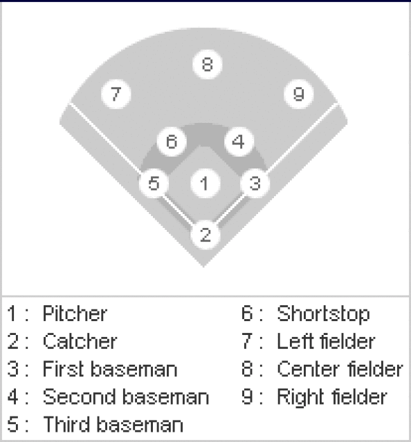

```{r setup, include=FALSE}

knitr::opts_chunk$set(echo = TRUE, out.width = '100%')

# knitr::opts_chunk$set(out.width = '100%')


source("Analisis.R")


```


*Práctica de Análisis multivariante PCA & FA*


```{r libraries, include=FALSE}

library(kableExtra)
library(DT)
library(summarytools)
library(plotly)


```


<!-- ## Quarterly Results {.tabset .tabset-fade .tabset-pills} -->

<!-- ### By Product -->

<!-- (tab content) -->

<!-- ### By Region -->

<!-- (tab content) -->


## Introducción

Se ha elegido para este ejercicio las estadísticas de bateo de las Grandes Ligas de Béisbol de los Estados Unidos, utilizando los datos de jugadores de todos los tiempos. Se ha obtenido la información en su sitio oficial [https://www.mlb.com/es/].


### Sobre el Béisbol

El béisbol (del inglés: baseball), es un deporte de equipo jugado entre dos grupos de nueve jugadores cada uno. Los países considerados potencias de este deporte se encuentran concentrados en América (Norte, Central, Caribe) y en Asia. Europa cuenta con dos buenos exponentes (Países Bajos e Italia); y en África destaca la selección de Sudáfrica.

__Objetivo del juego:__ conseguir más carreras que el rival. Básicamente se trata de que un equipo de bateadores/corredores, golpee o batee (hitting) la pelota de béisbol, de manera que esto les permita avanzar sobre las bases, hasta completar una carrera antes de que el equipo al campo tome la bola. El lanzador (del equipo contrario) dispone de cuatro posibles lanzamientos, que, de resultar erróneos, permitirían al bateador/corredor avanzar a primera base, mientras que el bateador/corredor dispone de tres intentos para batear (strike), antes de ser eliminado.

<!-- __El terreno de juego__ [https://respuestas.tips/medidas-de-un-campo-o-cancha-de-beisbol/] -->

<!--  -->

<!-- __Posiciones de los jugadores en el terreno__ [https://es.slideshare.net/amateotinez/reglas-bsicas-de-besbolsftbol] -->

<!--  -->

<!-- {width=45%} {width=50%} -->

__Posiciones de los jugadores en el terreno de juego__

{width=70%} {width=28%}


A continuación, se dejan dos links a videos con la explicación de los conceptos más generales de este bello deporte:
*	[https://www.youtube.com/watch?v=bSZ-Ww4G_MY]
*	[https://www.youtube.com/watch?v=skOsApsF0jQ]


### Sobre Las Ligas Mayores de Béisbol (MLB)

Las Ligas Mayores de Béisbol (en inglés Major League Baseball o MLB) son las ligas de béisbol profesional de mayor nivel de los Estados Unidos. Actualmente la MLB cuenta con 30 equipos repartidos en la Liga Nacional y la Liga Americana, fundadas en 1876 y 1901 respectivamente. En 2000 las dos ligas se fusionaron legalmente en la MLB. 


### Sobre el dataset

El dataset consta de 18 variables, que serán explicadas a continuación, y 934 registros, cada una de los cuales hace referencia a un jugador.


```{r , echo=FALSE, results='asis'}


variables <- data.frame(#"No." = c(1:18),
                        "Variable" = c("PLAYER", "POS", "G", "AB", "R", "H", 
                                       "2B", "3B", "HR",
                                       "RBI", "BB", "SO", 
                                       "SB", "CS", "AVG", 
                                       "OBP", "SLG", "OPS"), 
                        "Significado" = c("Jugador", "Posición", "Games / Juegos", "At Bat / Al bate", "Runs / Carreras", "Hits", 
                                          "two-base / Doble", "three-base hit / Triple", "Home run",
                                          "Run Batted In / Carreras Impulsadas", "Bases por Bola", "Strike Out o Out",
                                          "Stolen Base / Bases Robadas", "Caught Steeling / Atrapado Robando", "Average / Promedio de bateo",
                                          "On Base Percetage / Porcentaje de embasarse", "Slugging Percetage", "On-base percentage plus slugging"),
                        "Descripción" = c("Nombre del jugador",
                                          "Posición del jugador en el terreno",
                                          "Número de juegos en los que el jugador participa",
                                          "Número de veces al bate, excluyendo sacrificios, bases por bola, o golpeado por el lanzador",
                                          "Número de veces que el bateador pasa por todas las bases y llega a homeplate sin ser out",
                                          "Número de veces que el jugador batea la bola y alcanza primera base sin quedar out",
                                          "Número de veces que el jugador batea la bola y alcanza segunda base sin quedar out",
                                          "Número de veces que el jugador batea la bola y alcanza tercera base sin quedar out",
                                          "Número de veces que el jugador batea la bola y recorre todas las bases ya sea con la bola dentro o fuera del campo",
                                          "número de veces que un jugador permite carreras anotadas de otros jugadores en bases o incluso él mismo si llega a *homeplate*",
                                          "Número de veces que el bateador recibe base por bolas (tras 4 bolas fuera de la zona de strike en un turno al bate)",
                                          "Tres strikes en un turno al bate",
                                          "Número de veces que un jugador pasa de una base a otra sin que lo tomen out",
                                          "Número de veces que un jugador es puesto out en un intento de robo de base",
                                          "Indica el porcentaje entre la cantidad de hits y el número de turnos al bate: *AVG=H/AB*. Se considera un buen average a partir de los *.300* ",
                                          "Porciento que da una medida de la capacidad  del bateador para llegar a alguna base. Calcula la relación entre *(H+BB+HBP)/(AB+BB+HBP+SF)* donde HBP (Hit By Pitch) es la cantidad de veces que el bateador es golpeado por el lanzador y SF (Sacrifice Fly) es la cantidad de veces que un jugador batea una bola elevada que eventualmente será out pero que sirve para que otro jugador adelante una base. Un buen OBP es de *.333*",
                                          "Medida del poder del bateador. Representa el porcentaje de los turnos al bate con respecto a las bases alcanzadas. Se divide la cantidad total de bases recorridas (TB) por las veces al bate. El slugging otorga más peso a los extrabases, es decir, se asigna uno por cada sencillo (1B), dos por cada doble (2B), tres por cada triple (3B) y cuatro por cada home run (HR). Las fórmulas para el cálculo son: Se *TB=(1B)+(2x2B)+(3x3B)+(4xHR)* y *SLG=TB/AB*, Se considera un buen slugging a partir de los *.500* ", 
                                          "Mide la contribución total de un jugador, toma en cuenta su poder y su capacidad de embasarse. Su fórmula es *OPS=OBP+SLG*. Un buen OPS debe ser de *.753*"
                                          ))

 

kable(variables, "html",  caption = "") %>%
    kable_styling(bootstrap_options = c("striped", "hover"), position = "center", full_width = TRUE, font_size = 11) %>%
  column_spec(2, width = "20em")


```


## Análisis exploratorio

Se realiza un análisis exploratorio de los datos. Se asegura que todas las variables del dataset sean numéricas exceptuando las dos primeras que almacenan el nombre de jugador y su posición en el terreno. Adicionalmente a esto, se realiza un tratamiento para los missing values en el dataset.


### Dataset

```{r dataset, echo=FALSE, results='asis'}


library(RColorBrewer)


dt <-datatable(mlb_Hitting, class = 'cell-border stripe', rownames = F, options = list(pageLength = 10, autoWidth = TRUE))  %>%
  formatStyle(columns = c(1:length(mlb_Hitting)), fontSize = '70%') %>%
  formatStyle(
    'POS',
    transform = 'rotateX(45deg) rotateY(20deg) rotateZ(30deg)',
    background = styleEqual(
      unique(mlb_Hitting$POS), brewer.pal(unique(mlb_Hitting$POS)%>%length(),"Set3")
    )
  ) 

for( x in 3:(length(mlb_Hitting)-4)){
  dt <- dt %>%
    DT::formatStyle(
      x,
      background = DT::styleColorBar(mlb_Hitting[[x]],"steelblue"),
      backgroundSize = '100% 90%',
      backgroundRepeat = 'no-repeat',
      backgroundPosition = 'center'
    )
}

threshold <- setNames(c(.300, .333, .500, .753), c("AVG", "OBP", "SLG", "OPS"))
for( x in names(threshold)){
  dt <- dt %>%
  DT::formatStyle(
    x,
    fontWeight =  'bold',
    color = styleInterval(threshold[[x]], c( 'red', 'darkgreen')),
    backgroundColor = styleInterval(threshold[[x]], c('lightpink', 'lightgreen'))
  )
}

dt


```


### Análisis univariante  {.tabset}

```{r echo=FALSE, results='asis', fig.height=4}
kable(descr(mlb_Hitting)[1:7,]%>%round(2), "html",  caption = "Estadísticos") %>%
    kable_styling(bootstrap_options = c("striped", "hover"), position = "center", full_width = TRUE, font_size = 11) 
```

#### Histograms
```{r echo=FALSE, results='asis', fig.height=4}
print(hist)
```

#### Boxplots
```{r echo=FALSE, results='asis', fig.height=4}
print(bxp)
```


### Análisis bivariante


```{r echo=FALSE, results='asis'}


corrplot(cor_matrix,
         method="color", 
         type="upper",
         order="hclust", 
         addCoef.col = "black", 
         tl.col="black", tl.srt=45, tl.cex =.5,
         cl.cex =.5,
         number.cex=.5)

# p.mat = round(as.matrix(ff$p),3),
#            method = 'circle',
#            type = 'lower',
#            sig.level = c(.001, .01, .05), 
#            tl.pos="lt", 
#            tl.col="black", tl.cex=1.3, 
#            tl.offset=0.2,
#            cl.pos="r",
#            insig = "label_sig",
#            pch.cex = 1.3,
#            pch.col="red",
#            cl.cex = 1.3


```


### Algunos insigths relevantes


#### ¿Cómo batean los jugadores por posiciones? {.tabset}

##### Observaciones
```{r echo=FALSE, results='asis'}
# print(p_playerByPos)
ggplotly(p_playerByPos, tooltip = "label")
```

##### Nombres de jugadores
```{r echo=FALSE, results='asis'}
# print(p_playerByPosNames)
ggplotly(p_playerByPosNames)
```


#### ¿Cómo impulsan por posiciones? {.tabset}

##### Observaciones
```{r echo=FALSE, results='asis'}
# print(p_impulseByPos)
ggplotly(p_impulseByPos, tooltip = "label")
```

##### Nombres de jugadores
```{r echo=FALSE, results='asis'}
# print(p_impulseByPosNames)
ggplotly(p_impulseByPosNames)
```


#### Relación de home runs y juegos {.tabset}

##### Observaciones
```{r echo=FALSE, results='asis'}
# print(p_impulseByPos)
ggplotly(p_hrByG, tooltip = "label")
```

##### Nombres de jugadores
```{r echo=FALSE, results='asis'}
# print(p_impulseByPosNames)
ggplotly(p_hrByGNames)
```


#### ¿Cómo roban los bateadores las bases por posiciones? {.tabset}

##### Observaciones
```{r echo=FALSE, results='asis'}
# print(p_impulseByPos)
ggplotly(p_sbByPos, tooltip = "label")
```

##### Nombres de jugadores
```{r echo=FALSE, results='asis'}
# print(p_impulseByPosNames)
ggplotly(p_sbByPosNames)
```


#### ¿Cuánto batea un jugador comparado con la cantidad de veces al bate? {.tabset}

##### Observaciones
```{r echo=FALSE, results='asis'}
# print(p_impulseByPos)
ggplotly(p_avgByAb, tooltip = "label")
```

##### Nombres de jugadores
```{r echo=FALSE, results='asis'}
# print(p_impulseByPosNames)
ggplotly(p_avgByAbNames)
```


## Análisis multivariante

### Análisis de componenes principales (PCA) 

*WORK IN PROGRESS*

### Análisis Discriminante 


*WORK IN PROGRESS*


