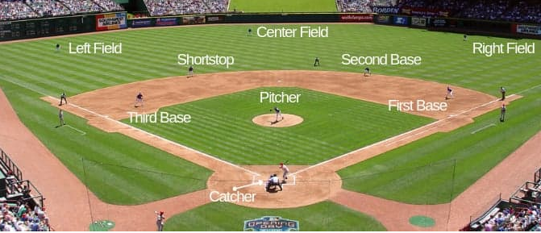

```{r setup, include=FALSE}

knitr::opts_chunk$set(echo = TRUE, out.width = '100%')

# knitr::opts_chunk$set(out.width = '100%')


source("Analisis.R")


```


*Práctica de Análisis multivariante PCA & FA*


```{r libraries, include=FALSE}

library(kableExtra)
library(DT)
library(summarytools)
library(RColorBrewer)
library(plotly)


```


<!-- ## Quarterly Results {.tabset .tabset-fade .tabset-pills} -->

<!-- ### By Product -->

<!-- (tab content) -->

<!-- ### By Region -->

<!-- (tab content) -->


## Introducción

Se ha elegido para este ejercicio las estadísticas de bateo de las Grandes Ligas de Béisbol de los Estados Unidos, utilizando los datos de jugadores de todos los tiempos. Se ha obtenido la información en su sitio oficial [https://www.mlb.com/es/].


### Sobre el Béisbol

El béisbol (del inglés: baseball), es un deporte de equipo jugado entre dos grupos de nueve jugadores cada uno. Los países considerados potencias de este deporte se encuentran concentrados en América (Norte, Central, Caribe) y en Asia. Europa cuenta con dos buenos exponentes (Países Bajos e Italia); y en África destaca la selección de Sudáfrica.

__Objetivo del juego:__ conseguir más carreras que el rival. Básicamente se trata de que un equipo de bateadores/corredores, golpee o batee (hitting) la pelota de béisbol, de manera que esto les permita avanzar sobre las bases, hasta completar una carrera antes de que el equipo al campo tome la bola. El lanzador (del equipo contrario) dispone de cuatro posibles lanzamientos, que, de resultar erróneos, permitirían al bateador/corredor avanzar a primera base, mientras que el bateador/corredor dispone de tres intentos para batear (strike), antes de ser eliminado.

<!-- __El terreno de juego__ [https://respuestas.tips/medidas-de-un-campo-o-cancha-de-beisbol/] -->

<!--  -->

<!-- __Posiciones de los jugadores en el terreno__ [https://es.slideshare.net/amateotinez/reglas-bsicas-de-besbolsftbol] -->

<!--  -->

<!-- {width=45%} {width=50%} -->

__Posiciones de los jugadores en el terreno de juego__

{width=70%} {width=28%}


A continuación, se dejan dos links a videos con la explicación de los conceptos más generales de este bello deporte:
*	[https://www.youtube.com/watch?v=bSZ-Ww4G_MY]
*	[https://www.youtube.com/watch?v=skOsApsF0jQ]


### Sobre Las Ligas Mayores de Béisbol (MLB)

Las Ligas Mayores de Béisbol (en inglés Major League Baseball o MLB) son las ligas de béisbol profesional de mayor nivel de los Estados Unidos. Actualmente la MLB cuenta con 30 equipos repartidos en la Liga Nacional y la Liga Americana, fundadas en 1876 y 1901 respectivamente. En 2000 las dos ligas se fusionaron legalmente en la MLB. 


### Sobre el dataset

El dataset consta de 18 variables, que serán explicadas a continuación, y 934 registros, cada una de los cuales hace referencia a un jugador.


```{r , echo=FALSE, results='asis'}


variables <- data.frame(#"No." = c(1:18),
                        "Variable" = c("PLAYER", "POS", "G", "AB", "R", "H", 
                                       "2B", "3B", "HR",
                                       "RBI", "BB", "SO", 
                                       "SB", "CS", "AVG", 
                                       "OBP", "SLG", "OPS"), 
                        "Significado" = c("Jugador", "Posición", "Games / Juegos", "At Bat / Al bate", "Runs / Carreras", "Hits", 
                                          "two-base hit / Doble", "three-base hit / Triple", "Home run",
                                          "Run Batted In / Carreras Impulsadas", "Bases por Bola", "Strike Out o Out",
                                          "Stolen Base / Bases Robadas", "Caught Steeling / Atrapado Robando", "Average / Promedio de bateo",
                                          "On Base Percetage / Porcentaje de embasarse", "Slugging Percetage", "On-base percentage plus slugging"),
                        "Descripción" = c("Nombre del jugador",
                                          "Posición del jugador en el terreno",
                                          "Número de juegos en los que el jugador participa",
                                          "Número de veces al bate, excluyendo sacrificios, bases por bola, o golpeado por el lanzador",
                                          "Número de veces que el bateador pasa por todas las bases y llega a homeplate sin ser out",
                                          "Número de veces que el jugador batea la bola y alcanza primera base sin quedar out",
                                          "Número de veces que el jugador batea la bola y alcanza segunda base sin quedar out",
                                          "Número de veces que el jugador batea la bola y alcanza tercera base sin quedar out",
                                          "Número de veces que el jugador batea la bola y recorre todas las bases ya sea con la bola dentro o fuera del campo",
                                          "número de veces que un jugador permite carreras anotadas de otros jugadores en bases o incluso él mismo si llega a *homeplate*",
                                          "Número de veces que el bateador recibe base por bolas (tras 4 bolas fuera de la zona de strike en un turno al bate)",
                                          "Tres strikes en un turno al bate",
                                          "Número de veces que un jugador pasa de una base a otra sin que lo tomen out",
                                          "Número de veces que un jugador es puesto out en un intento de robo de base",
                                          "Habilidad de un pelotero para conectar hits. Indica el porcentaje entre la cantidad de hits y el número de turnos al bate: *AVG=H/AB*. Se considera un excelente average a partir de los *.300* ",
                                          "Capacidad  del bateador para llegar a alguna base. Calcula la relación entre *(H+BB+HBP)/(AB+BB+HBP+SF)* donde HBP (Hit By Pitch) es la cantidad de veces que el bateador es golpeado por el lanzador y SF (Sacrifice Fly) es la cantidad de veces que un jugador batea una bola elevada que eventualmente será out pero que sirve para que otro jugador adelante una base. Un buen OBP está por encima de *.333*",
                                          "Medida del poder del bateador. Representa el porcentaje de los turnos al bate con respecto a las bases alcanzadas. Se divide la cantidad total de bases recorridas (TB) por las veces al bate. El slugging otorga más peso a los extrabases, es decir, se asigna uno por cada sencillo (1B), dos por cada doble (2B), tres por cada triple (3B) y cuatro por cada home run (HR). Las fórmulas para el cálculo son: *TB=(1B)+(2x2B)+(3x3B)+(4xHR)* y *SLG=TB/AB*, Se considera un buen slugging a partir de los *.500* ", 
                                          "Mide la contribución total de un jugador, toma en cuenta su poder y su capacidad de embasarse. Su fórmula es *OPS=OBP+SLG*. Un buen OPS debe ser de *.753*"
                                          ))

kable(variables, "html",  caption = "") %>%
    kable_styling(bootstrap_options = c("striped", "hover"), position = "center", full_width = TRUE, font_size = 11) %>%
  column_spec(2, width = "20em")

```

Nota: Las variables: H, 2B, 3B y HR, indican el performance más general del bateador, cuánto batea y su capacidad de alcanzar alguna base. 


## Análisis exploratorio

Se realiza un análisis exploratorio de los datos. Se asegura que todas las variables del dataset sean numéricas exceptuando las dos primeras que almacenan el nombre de jugador y su posición en el terreno, que serán categóricas. Adicionalmente a esto, se realiza un tratamiento para los missing values en el dataset.


### Dataset

Se visualiza la tabla de datos con información adicionada:

 * Variables atómicas: Se agrega una barra a cada celda que represanta el porcentaje con respecto al total para cada registro.
 
 * Variables calculadas: Se colorea el background de la celda de rojo o verde, que representa qué tan bueno es un jugador con respecto a cada variable.

```{r dataset, echo=FALSE, results='asis'}

dt <-datatable(mlb_Hitting, class = 'cell-border stripe', rownames = F, options = list(pageLength = 15, autoWidth = TRUE))  %>%
  formatStyle(columns = c(1:length(mlb_Hitting)), fontSize = '70%') %>%
  formatStyle(
    'POS',
    transform = 'rotateX(45deg) rotateY(20deg) rotateZ(30deg)',
    background = styleEqual(
      unique(mlb_Hitting$POS), brewer.pal(unique(mlb_Hitting$POS)%>%length(),"Set3")
    )
  ) 

for( x in 3:(length(mlb_Hitting)-4)){
  dt <- dt %>%
    DT::formatStyle(
      x,
      background = DT::styleColorBar(mlb_Hitting[[x]],"steelblue"),
      backgroundSize = '100% 90%',
      backgroundRepeat = 'no-repeat',
      backgroundPosition = 'center'
    )
}

threshold <- setNames(c(.300, .333, .500, .753), c("AVG", "OBP", "SLG", "OPS"))
for( x in names(threshold)){
  dt <- dt %>%
  DT::formatStyle(
    x,
    fontWeight =  'bold',
    color = styleInterval(threshold[[x]], c( 'red', 'darkgreen')),
    backgroundColor = styleInterval(threshold[[x]], c('lightpink', 'lightgreen'))
  )
}

dt


```


### Análisis univariante  {.tabset}

```{r echo=FALSE, results='asis', fig.height=4}
kable(descr(mlb_Hitting, order = "p")[1:7,] %>% round(2), "html",  
      caption = "Estadísticos") %>%
    kable_styling(bootstrap_options = c("striped", "hover"), position = "center", full_width = TRUE, font_size = 11) 
```

#### Histogramas
En general curvas asimétricas, con excepción de las variables calculadas (*AVG*, *OBP*, *SLG* y *OPS*) que presentan una distribución más cercana a la distribución Normal. 
```{r echo=FALSE, results='asis', fig.height=4}
print(hist)
```

---

#### Boxplots
Cajas generalmente bajas y bastantes outliers superiores en todas las variables. Estos outliers representan jugadores que destacan del resto y que por consiguiente son muy buenos en base al indicador o variable observada. 
Es importante tener en cuenta que las variables *SO (Strike Out)* y *CS (Catch Stealing)* tienen efecto inverso en realción a ganar el juego, es decir que a mayor valor de estas variables más negativas resultan. 
```{r echo=FALSE, results='asis', fig.height=4}
print(bxp2)
```
 
---
 
#### Boxplots2
Las variables se encuentran rangos de valores muy diferentes, esto puede afectar al cálculo posterior de las componentes principales. Se necesitará estandarizar la matriz de datos.
```{r echo=FALSE, results='asis', fig.height=4}
ggplotly(bxp)
```

---


### Análisis bivariante


Se analiza el dataset para encontrar correlaciones por pares de variables utilizando un threshold de `r threshold_corr = 0.85` `r threshold_corr`  

```{r echo=FALSE, results='asis'}

# threshold_corr = .85

positive_correlated<-more_corelated_pairs(threshold = threshold_corr)
negative_correlated<-more_corelated_pairs(sing="N", threshold = threshold_corr)

add_desc <- function(x){
  meaning <- variables[variables$Variable %in% x,"Significado"]
  return(paste0(x, " (", meaning,")"))
}

positive_correlated$Variable1<-add_desc(positive_correlated$Variable1)
positive_correlated$Variable2<-add_desc(positive_correlated$Variable2)

kable(positive_correlated, "html", caption = "Corración positiva",
      table.attr = "style='width:48%;'") %>% 
  kableExtra::kable_styling(bootstrap_options = c("striped", "hover"),
        position = "float_left", font_size = 11)


kable(negative_correlated, "html", caption = "Corración negativa",
      table.attr = "style='width:48%;'") %>%
  kableExtra::kable_styling(bootstrap_options = c("striped", "hover"),
        position = "right", font_size = 11)


```


```{r echo=FALSE, results='asis'}

corrplot(cor_matrix,
         method="color", 
         type="upper",
         order="hclust", 
         addCoef.col = "black", 
         tl.col="black", tl.srt=45, tl.cex =.5,
         cl.cex =.5,
         number.cex=.5)

```


### Algunos insigths interesantes

<br>

#### **1. Impulsadas vs Veces al Bate (por Posiciones)** {.tabset}
Los jugadores que batean en un momento decisivo del juego ayudando a que otros que estén en el campo logren obtener bases, son jugadores muy valiosos. En muchos casos hacen un *bateo de sacrificio* que implica que él pierde la posibilidad de llegar a primera base para que otro jugador pueda avanzar en el terreno. Esto es lo que almacena la variable *RBI* y vale la pena estudiarla. 

##### Observaciones
La Gráfica muestra *Carreras Impulsadas (RBI)* contra las *Veces al bate*. El color está representado por las posiciones del terreno *(POS)* y tamaño por el average *(AVG)*. 
```{r echo=FALSE, results='asis', message=FALSE}
ggplotly(p_impulseByPos, tooltip = c("text","label","x","y"))
```
Homogeneidad entre las posiciones, las líneas de tendencias tienen casi todas la misma pendiente, por tanto no influyen las *posiciones* en las *impulsadas*. Relación lineal entre las variables con cierta dispersión. 

---

##### Nombres de jugadores
```{r echo=FALSE, results='asis'}
ggplotly(p_impulseByPosNames, tooltip = c("label","x","y"))
```
Los mejores jugadores tendrán más *impulsadas* por *veces al bate*: Bebe Ruth, Lou Gehrin, Albert Pujols, Alex Rodriguez y Barry Bonds. 

---


#### **2. Relación entre Home Runs y Veces al Bate (por Posiciones)** {.tabset}
Si el bateador hace contacto con la pelota de manera que le permita recorrer todas las bases y anotar una carrera, se ha realizado un home run o cuadrangular. La forma más común es cuando el bateador golpea la pelota y la saca al exterior del campo de juego. Es una de las jugadas más populares y difíciles para el bateador, por ello los jugadores que usualmente logran hacer este tipo de jugadas son muy valorados en el terreno.

##### Observaciones
La Gráfica muestra *Home runs (HR)* contra las *juegos (G)*. El color está representado por las posiciones del terreno *(POS)* y tamaño por el average *(AVG)*. 
```{r echo=FALSE, results='asis', message=FALSE}
ggplotly(p_hrByPos, tooltip = c("text","label","x","y"))
```
Mucha dispersión y aglomeración de datos por debajo de *400 HR*, esto se debe precisamente a lo difícil de anotar home runs. Las líneas de tendencia marcan los *HR* por posiciones: *Tercera Base (3B)*, *Cathcers (C)*, *Of Field (OF)* y *Right field (RF)* presentan una pendiente ligeramente superior al resto, por tanto en general son mejores anotando home runs. 

---

##### Nombres de jugadores
Misma gráfica pero mostrando el nombre de los jugadores.
```{r echo=FALSE, results='asis'}
# print(p_impulseByPosNames)
ggplotly(p_hrByPosNames, tooltip = c("label","x","y")) 
```
Los mejores jugadores tendrán más *home runs (eje y)* con menos *veces al bate (eje x)*. LOs mejores en este análisis son: Mark McGwire, Jim Thome, Sammy Sosa, ken Griffey, Baby Ruth, Barry Bonds.

---

#### **3. Relación entre Bases Robadas y Número de Juegos (por posiciones)** {.tabset}
Robar una base es moverse de una base a otra aprovechando que el pitcher no tiene posibilidad en ese momento de darle out, generalmente esto ocurre cuando el pitcher se está preparando para lanzar la pelota al bateador. Para robar una base el jugador tiene que ser muy rápido, ágil y astuto para utilizar el momento justo para actuar, y al mismo tiempo evitar un out.

##### Observaciones
La Gráfica muestra *Bases robadas (SB)* contra las *juegos (G)*. El color está representado por las posiciones del terreno *(POS)* y tamaño por el *Average (AVG)*. 
```{r echo=FALSE, results='asis', message=FALSE}
ggplotly(p_sbByPos, tooltip = "label")
```
La gráfica muestra que la mayoría de los jugadores no roban demasiadas bases. Según las líneas de tendencia que indican las posiciones, los jugadores que más roban son el *Segunda Base (2B)*, *Left Field (LF)* y *Campo Corto (SS)*. 

---

##### Nombres de jugadores
```{r echo=FALSE, results='asis'}
ggplotly(p_sbByPosNames)
```
Los mejores jugadores tendrán más *bases robadas (SB)* con menos *juegos realizados*. Los mejores en este análisis son: Rickey Henderson, Billy Hamilton, Vince Coleman, Arlie Latham.

---

## Análisis multivariante

### Análisis de componenes principales (PCA) 

El Análisis de Componentes Principales (PCA) es una técnica estadística de reducción de la dimensión (número de variables). Es decir, ante un banco de datos con muchas variables, el objetivo será reducirlas a un menor número perdiendo la menor cantidad de información posible. Las nuevas componentes principales serán una combinación lineal de las variables originales e independientes entre sí. 

Se utilizan las técnicas de PCA si existen altas correlaciones entre las variables, ya que esto es indicativo de información redundante y, por tanto, pocos factores podrán explicar gran parte de la variabilidad total que recogen. El PCA ayuda a determinar si las variables son más o menos parecidas y si existe algún tipo de estructura o agrupación entre ellas.  

Las componentes se van construyendo según el orden de importancia en cuanto a la variabilidad total, de tal forma que la primera recoge la mayor proporción posible de la variabilidad original; la segunda recoge la máxima variabilidad posible no recogida por la primera, y así sucesivamente. 

#### **Variabilidad de las componenes**

La proporción de variabilidad retenida por las componentes principales se puede extraer mediante los valores propios *(eigen values)*. Los datos de la varianza son muy importantes para saber cuántas componentes principales serán utilizadas para el análisis. 

**¿Cómo saber cuantas componentes escoger?** Una componente con valor propio mayor que 1, indica que la componente representa más varianza de la que tiene en cuenta una de las variables originales en los datos estandarizados. Ésto se usa comunmente, junto a la *cumulative percentage of variance*, como punto de corte para determinar la cantidad de componentes a escoger.

```{r echo=FALSE, results='asis', message=FALSE}
kable(importance_of_components, "html", caption = "Importancia de las componenetes",
      table.attr = "style='width:100%;'") %>%
  kableExtra::kable_styling(bootstrap_options = c("striped", "hover"),
        position = "center", font_size = 11)

names(cp_more_signif)<-paste( "component", 1:(cp_more_signif%>%names()%>%length()) )
```

Se puede escoger como punto de corte hasta la `r cp_more_signif %>% names() %>% last()` 
```{r echo=FALSE, results='asis', message=FALSE}

diff_comp1_comp2 <- importance_of_components$comp_1[1] - importance_of_components$comp_2[1]
diff_comp2_comp3 <- importance_of_components$comp_2[1] - importance_of_components$comp_3[1]

if(diff_comp1_comp2>4 & diff_comp2_comp3<1){ 
  #The first component is very high with respect to the rest of them.
  cat("La primera componente contiene una varianza bastante más elevada que el resto, por tanto tiene una mayor explicabilidad por sí sola.")
}
```

```{r echo=FALSE, results='asis', message=FALSE, warning=FALSE, fig.align='center', out.width='70%'}

# scrplot

library(shiny)
div(ggplotly(scrplot, width = 600), align = "center")

# ggplotly(scrplot) %>% layout(autosize = F, width = 500, height = 500)


```

#### **Análisis de las variables con respecto a las componentes**

Representación de las variables en las dimensiones más significativas.  

Indicadores importantes a tener en cuentas:

- **cos2**: Calidad de las variables sobre las componentes representadas. 

- **contrib**: Contribuciones de las variables a cada componente.


```{r echo=FALSE, results='asis', message=FALSE, warning=FALSE, out.width="50%"}

var_PC1yPC2
var_PC1yPC3

# grid.arrange(var_PC1yPC2, var_PC1yPC3, ncol=2)
# subplot(ggplotly(var_PC1yPC2, mode='text'), ggplotly(var_PC1yPC3, mode='text'))ç
```


*WORK IN PROGRESS*

### Análisis Discriminante 


*WORK IN PROGRESS*


